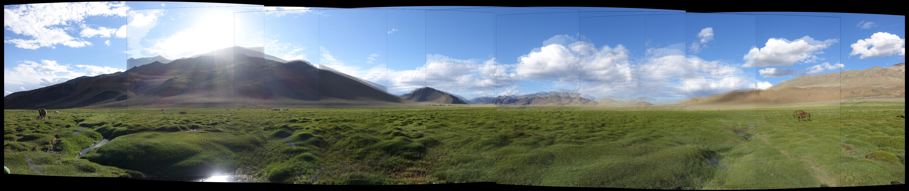

# 3DR
Collection of tools ranging from image alignment, panorama generation, point cloud generation, optical flow estimation to single view 3D reconstruction.

---
## TODO
- [x] Image Alignment
- [x] Image Warping
- [x] Panorama stitching
- [ ] Ghost removal in big panoramas (refer [1])
- [ ] Optical Flow
- [ ] SfM
- [ ] Bundle Adjustment
- [ ] SLAM graph optimization

## Requirements
- C++14
- Linux (tested only on Ubuntu 18.10)
- OpenCV (for image I/O)
- g2o (for Bundle Adjustment)
- Pangolin (for 3D viewer)

## References
1. M. Uyttendaele, A. Eden, and R. Szeliski.
    Eliminating ghosting and exposure artifacts in image mosaics.
    In Proceedings of the Interational Conference on Computer Vision and Pattern Recognition
