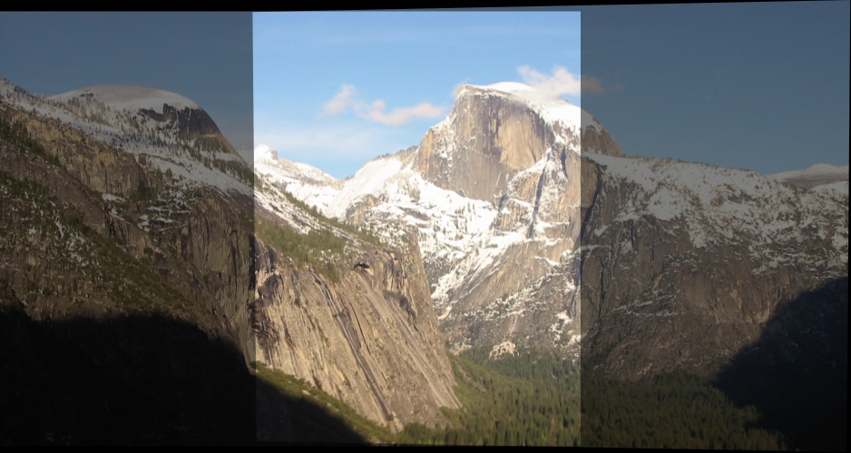
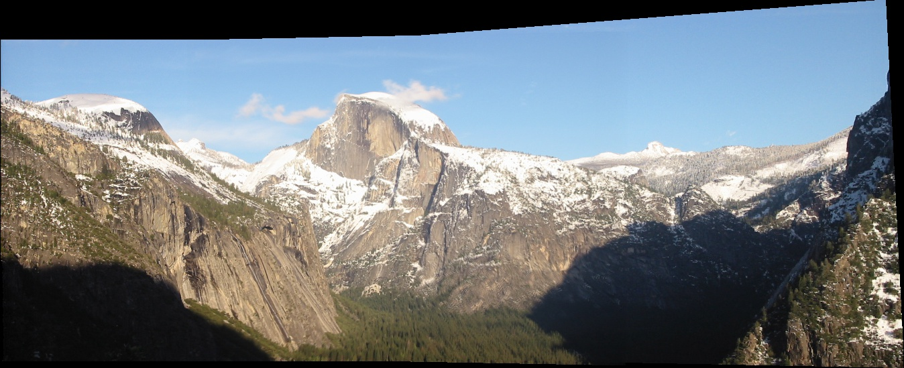

# 3D Reconstruction
Collection of tools ranging from image alignment, panorama generation, point cloud generation, optical flow estimation to single view 3D reconstruction

## TODO
- [x] Image Alignment
- [x] Panorama stitching
- [ ] Stereo Stitching
- [ ] SfM (Structure from motion)
- [ ] Point Cloud generation

## Requirements
- C++14
- Linux (tested only on 18.04 LTS)
- OpenCV

## Current Progress

### Image Alignment

### Panorama Generation

