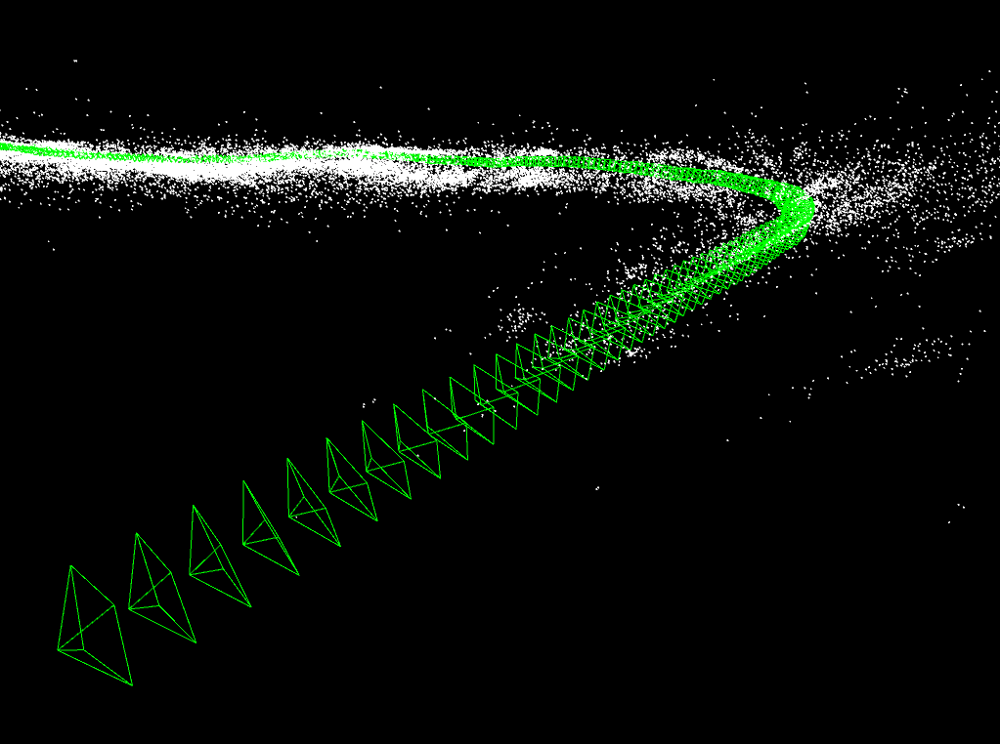

# 3DR
Collection of tools ranging from image alignment, panorama generation, point cloud generation, optical flow estimation to single view 3D reconstruction.

<p align="center"></p>
Tracking camera (without Bundle Adjustment). Video: (KITTI `sequence/00`)

## Usage
1. Build all the executables
```bash
git clone git@github.com:kvmanohar22/3DR.git
mkdir build
cd build
cmake ..
make
```
2. SLAM
- First download videos from KITTI dataset [link](http://www.cvlibs.net/datasets/kitti/eval_stereo.php)
- Set the path to the video sequence in `scripts/slam.sh`
```bash
cd scripts/
./slam.sh
``` 

## TODO
- [x] Image Alignment
- [x] Image Warping
- [x] Panorama stitching
- [x] Visual Odometry
- [ ] Sparse Visual Odometry
- [ ] Tracking
- [ ] Ghost removal in big panoramas (refer [1])
- [ ] Optical Flow
- [ ] SfM (unordered images)
- [x] SfM (video sequence (localisation))

## To fix
- [ ] Cholesky Decomposition fails during BA
- [ ] Optimization is ridiculously slow (but works). Should make it faster
- [x] Fliped y-axis in 3D viewer?
- [ ] Add only KeyFrames for graph optimization
- [ ] Reduce the number of points for graph optimization


## Requirements
- C++14
- Linux (tested only on Ubuntu 18.10)
- OpenCV (for image I/O)
- ceres-solver (for Bundle Adjustment)
- Pangolin (for 3D viewer)
- [fast](https://github.com/uzh-rpg/fast.git) (for fast corner detection)

## References
1. M. Uyttendaele, A. Eden, and R. Szeliski.
    Eliminating ghosting and exposure artifacts in image mosaics.
    In Proceedings of the Interational Conference on Computer Vision and Pattern Recognition

## LICENSE
All my code is MIT licensed

